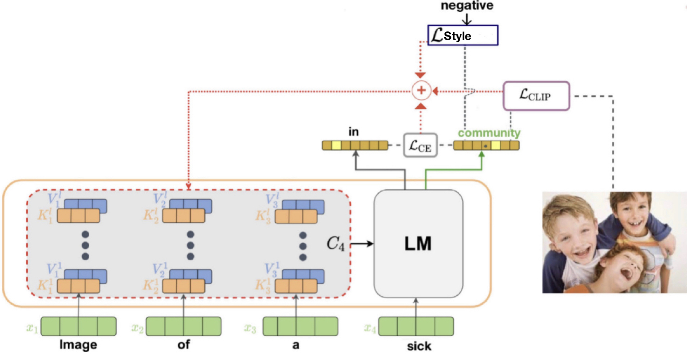

# zero-shot-style
Pytorch implementaion of Style Controllable Zero-Shot Image-to-Text Generation

## Approach



## Usage

### Set up environment:
```bash
$ pip install requirements.txt
$ pip install ftfy regex tqdm
$ pip install git+https://github.com/openai/CLIP.git
```

