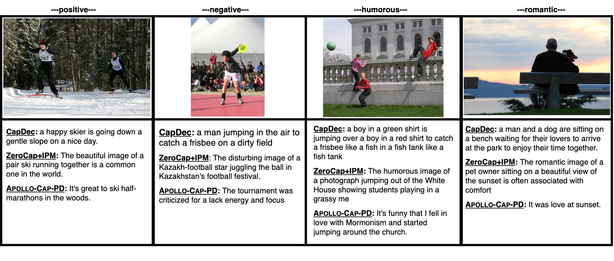
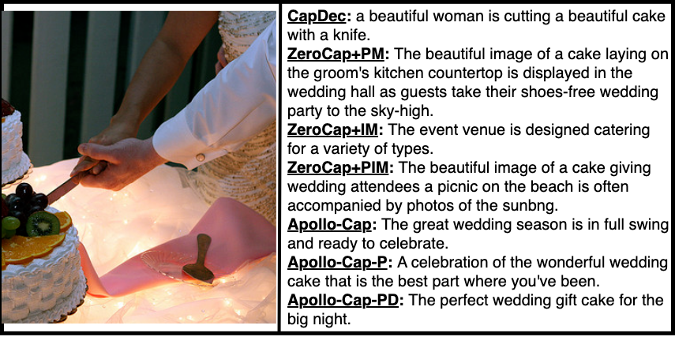

# zero-shot-style
Pytorch implementaion of 

### Set up environment:
```bash
$ pip install requirements.txt
$ pip install ftfy regex tqdm
$ pip install git+https://github.com/openai/CLIP.git
```
## Usage
### To generate positive caption for an image:
python run.y --desired_labels style
\\3 loss - positive:
python run.y --dataset senticap --desired_labels positive --ce_scale 1.96 --clip_scale 2.19 --text_style_scale 9.68 --sentiment_temperature 0.001 --max_num_of_imgs 1 --experiement_global_name 3loss_pos 
3 loss - negative:
python run.y --dataset senticap --desired_labels negative --ce_scale 2.855 --clip_scale 5.036 --text_style_scale 11.9 --sentiment_temperature 0.001 --max_num_of_imgs 1 --experiement_global_name 3loss_neg
mul - positive:
python run.y --dataset senticap --desired_labels positive --mul_clip_style --ce_scale 4 --clip_scale 8 --text_style_scale 0 --sentiment_temperature 0.01 --max_num_of_imgs 1 --experiement_global_name mul_pos
mul - negative:
python run.y --dataset senticap --desired_labels negative --mul_clip_style --ce_scale 0.6209475551271303 --clip_scale 2 --text_style_scale 0 --sentiment_temperature 0.08555964306820746 --max_num_of_imgs 1 --experiement_global_name mul_neg
decent-pos
python run.y --dataset senticap --desired_labels positive --mul_clip_style --update_ViT --ce_scale 0.2214432225421577 --clip_scale 1 --text_style_scale 0 --sentiment_temperature 0.1430339855494212 --num_iterations_clip_style 1 --max_num_of_imgs 1 --experiement_global_name update_pos
decent-neg
python run.y --dataset senticap --desired_labels negative --mul_clip_style --update_ViT --ce_scale 0.6070550610590508 --clip_scale 2 --text_style_scale 0 --sentiment_temperature 0.17425402664880124 --num_iterations_clip_style 1 --max_num_of_imgs 1 --experiement_global_name update_neg


3loss-humor:
python run.y --dataset flickrstyle10k --desired_labels humor --ce_scale 0.6604141408776456 --clip_scale 1 --text_style_scale 2.9876837003652907 --sentiment_temperature  0.001 --max_num_of_imgs 1 --experiement_global_name 3loss_humor
3loss-romantic:
python run.y --dataset flickrstyle10k --desired_labels romantic --ce_scale 0.7097647446401579 --clip_scale 1 --text_style_scale 4.332869432646197 --sentiment_temperature  0.001 --max_num_of_imgs 1 --experiement_global_name 3loss_humor
mul-humor:
python run.y --dataset flickrstyle10k --desired_labels humor --mul_clip_style --ce_scale 0.4173438996507689 --clip_scale 1 --text_style_scale 0 --sentiment_temperature 0.05089738868653932 --max_num_of_imgs 1 --experiement_global_name mul_humor
mul-romatic:
python run.y --dataset flickrstyle10k --desired_labels romantic --mul_clip_style --ce_scale 0.5 --clip_scale 1 --text_style_scale 0 --sentiment_temperature 0.05364761206623257 --max_num_of_imgs 1 --experiement_global_name mul_romantic
update-humor:
python run.y --dataset flickrstyle10k  --desired_labels humor --mul_clip_style --update_ViT --ce_scale 0.3426740175716766 --clip_scale 1 --text_style_scale 0 --sentiment_temperature 0.05655316717625009 --num_iterations_clip_style 1 --max_num_of_imgs 1 --experiement_global_name update_romantic
update-romantic:
python run.y --dataset flickrstyle10k  --desired_labels romantic --mul_clip_style --update_ViT --ce_scale 0.3735 --clip_scale 1 --text_style_scale 0 --sentiment_temperature 0.0672676323972359 --num_iterations_clip_style 1 --max_num_of_imgs 1 --experiement_global_name update_romantic


audio:
python run.y --mul_clip_style --ce_scale 4 --clip_scale 8 --text_style_scale 0 --sentiment_temperature 0.01  --use_audio_model --max_num_of_imgs 1 --experiement_global_name audio_laughter


humorous:
romatic:

### To generate caption for an image and audio:
python run.y --use_audio_model --audio_path --audio_sampling_rate


### To generate negative caption for an image:
### To generate romantic caption for an image:
### To generate humorous caption for an image:
## Examples
### Stylized Image Caption Generation
- Comparing APOLLO-CAP-PD, CapDec, and ZeroCap+IPM approaches across positive, negative, humorous, and romantic styles: 

- Comparing all approaches with a focus on positive image captions:
-- 
### Audio-Aware Image Caption Generation
- APOLLO-CAP-P caption examples for images and audio clips featuring children’s laughter:
- 


## Citation
If you use our work for your research, please cite:

